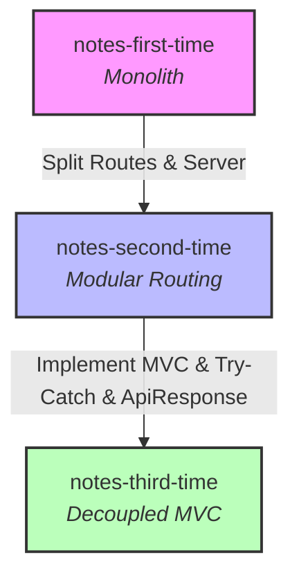

# Express + TypeScript + MongoDB Refactoring Roadmap 🚀

Welcome to the **tasks-by-kodex** repository! This project serves as an architectural evolution roadmap, showcasing three stages of refactoring an Express, TypeScript, and MongoDB (Mongoose) REST API for a notes management application. 

By progressing through these three directories, you can visualize how a monolithic API evolves into modular routes, and finally into a production-grade, enterprise-ready **Model-View-Controller (MVC)** architecture.

---

## 📂 Codebase Evolution & Directory Directory Variations

The codebase is split into three distinct versions, each representing a higher tier of software design patterns and architectural maturity.



### Architectural Comparison Table

| Attribute | 📂 `notes-first-time` (Monolith) | 📂 `notes-second-time` (Modular) | 📂 `notes-third-time` (Clean MVC) |
| :--- | :--- | :--- | :--- |
| **Design Pattern** | Monolithic / Single-file server | Modular Router Pattern | Fully decoupled MVC (Model-View-Controller) |
| **Route Logic Location** | `src/server.ts` | `src/routes/note.route.ts` | `src/controllers/notes.controller.ts` |
| **Server Responsibility** | Routes + Validations + DB operations + Server | Express app configuration & middleware routing | Express app configuration & middleware routing |
| **Error Handling** | None (Uncaught async rejections) | None (Uncaught async rejections) | **Robust `try-catch` blocks** returning 500 status |
| **Response Payload** | Ad-hoc JSON objects | Ad-hoc JSON objects | **Standardized `ApiResponse` utility class** |
| **CRUD Completeness** | Basic (Create, Read, Update) | Basic (Create, Read, Update) | **Complete (Create, Read, Update, Delete)** |
| **TypeScript Typing** | Low / Inferred | Basic Express typing | **Strong typing** (`Request`, `Response`, Generics) |

---

## 🔍 Detailed Directory Walkthroughs

### 1. `notes-first-time/` (The Monolith)
* **Goal**: Get the API working as quickly as possible.
* **Architecture**: Everything is placed directly within `src/server.ts`. The Express application initialization, database connection startup, HTTP route definitions, request validation rules, and direct Mongoose queries reside in a single file.
* **Drawbacks**: 
  > [!WARNING]
  > * **Zero Scalability**: Adding more database models or endpoints will bloat `server.ts` beyond maintainability.
  > * **No Exception Safety**: Database calls are not wrapped in try-catch blocks. Any database connection failure or query error will crash the Node server.
  > * **High Coupling**: Route parsing, input validations, database querying, and HTTP response crafting are tightly coupled.

---

### 2. `notes-second-time/` (Modular Routing)
* **Goal**: Separate route mappings from the main server setup.
* **Architecture**: 
  * `src/server.ts` is slimmed down to focus only on launching the server and mounting routes.
  * Express routers are introduced. All note-related endpoints are defined in `src/routes/note.route.ts` using `express.Router()` and mounted globally with `app.use("/api/notes", notesRouter)`.
* **Drawbacks**:
  > [!CAUTION]
  > * **Controller Coupling**: While routing is decoupled from server startup, the heavy controller logic, validations, and database interactions are still nested inside the router callbacks.
  > * **Syntax & Async Bugs**: 
  >   * Line 30 contains a critical validation response bug: `res.json(400).json({ ... })` instead of `res.status(400).json({ ... })`.
  >   * Line 80: `noteExist.save()` is not awaited (`await`), which can lead to race conditions or unhandled background database operations.
  >   * Incorrect HTTP status: Returns `204 No Content` but still tries to send a body payload on 404 situations (`Note not found`).
  >   * Typos in code strings (e.g. `"descrtiption"`).

---

### 3. `notes-third-time/` (Decoupled MVC & Production-Ready)
* **Goal**: Professional-grade codebase separation of concerns, absolute safety, and payload consistency.
* **Architecture**:
  * **Routes (`src/routes/notes.route.ts`)**: Purely maps URL endpoints to their controller functions.
  * **Controllers (`src/controllers/notes.controller.ts`)**: Decoupled, fully-typed functions handling business logic, validation, and request-response cycles.
  * **Models (`src/models/notes.model.ts`)**: Defines database schemas.
  * **Utilities (`src/utils/apiResponse.ts`)**: Implements a standard `ApiResponse` format wrapper for reliable client integration.
* **Key Enhancements**:
  > [!TIP]
  > * **Graceful Error Catching**: Every single asynchronous operation is wrapped in a robust `try-catch` block, preventing server crashes and returning a uniform `500 Internal Server Error` on system failure.
  > * **Standardized Payloads**: Successful requests always return a predictable format:
  >   ```json
  >   {
  >     "success": true,
  >     "message": "Note created successfully",
  >     "data": { ... }
  >   }
  >   ```
  > * **Full CRUD Support**: Adds the missing `DELETE /api/notes/:id` API handler.
  > * **Strict Types**: Leverages TypeScript's `Request` and `Response` interfaces correctly.

---

## 🛣️ API Routes & Documentation

All three apps run on port `6969` by default. The base prefix for all endpoints is `/api/notes`.

| Method | Endpoint | Description | Payload Expected (JSON) | Success Status | Found in Version |
| :--- | :--- | :--- | :--- | :---: | :--- |
| **GET** | `/` | Checks server health / status | None | `200 OK` | All Versions |
| **GET** | `/api/notes` | Fetches a list of all notes | None | `200 OK` | All Versions |
| **POST** | `/api/notes` | Creates a new note | `{ "title": "...", "description": "..." }` | `201 Created` | All Versions |
| **PATCH** | `/api/notes/:id` | Updates description of a note | `{ "description": "..." }` | `200 OK` | All Versions |
| **DELETE** | `/api/notes/:id` | Deletes a note by ID | None | `200 OK` | **`notes-third-time`** |

### Request Validation Rules (Enforced in all versions)

1. **POST `/api/notes`**:
   * `title` (String): Required, minimum **3 characters** (whitespace trimmed).
   * `description` (String): Required, minimum **10 characters** (whitespace trimmed).
2. **PATCH `/api/notes/:id`**:
   * `description` (String): Required, minimum **10 characters** (whitespace trimmed).

---

## 🛠️ Setting Up & Running the Projects

### Prerequisites
* [Node.js](https://nodejs.org/) (v18+)
* [pnpm](https://pnpm.io/) (Recommended) or `npm` / `yarn`
* A running [MongoDB](https://www.mongodb.com/) instance (local or Atlas)

### Step 1: Environment Variables Setup
Each of the three projects requires a `.env` file containing a `MONGODB_URI` database connection string. Copy the `.env` template or create a new file in your chosen version directory:

```bash
# Example for notes-third-time
cd notes-third-time
echo "MONGODB_URI=mongodb://localhost:27017/notes-task" > .env
```

### Step 2: Install Dependencies
Navigate to any of the three directories and run the installation command:

```bash
# Using pnpm
pnpm install

# Using npm
npm install
```

### Step 3: Run the Development Server
Execute the watch script to spin up the hot-reloading development server:

```bash
pnpm run dev
# or
npm run dev
```

The server will log `Server running on port: 6969` once initialized successfully. You can then test the routes using tools like Postman, Bruno, or curl.

---

## 💡 Summary of Software Engineering Best Practices Demonstrated

This repository highlights critical architectural lessons:
1. **Separation of Concerns**: Keeping routes lightweight makes code much easier to read and test.
2. **Robustness**: Always wrap asynchronous database transactions in `try-catch` blocks to protect server runtime.
3. **Consistency**: Utilizing standard response utilities like `ApiResponse` makes UI-client integrations seamless and predictable.
4. **Validation**: Validate request bodies early and gracefully return descriptive `400 Bad Request` messages before performing database calls.
